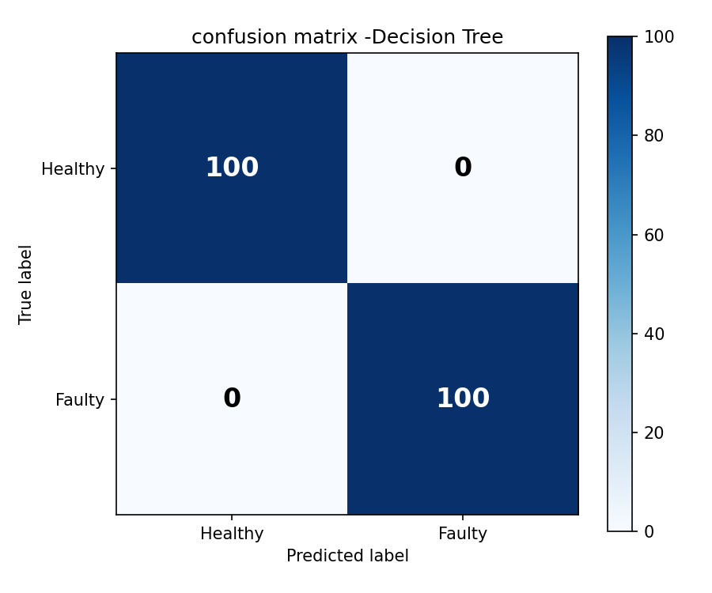
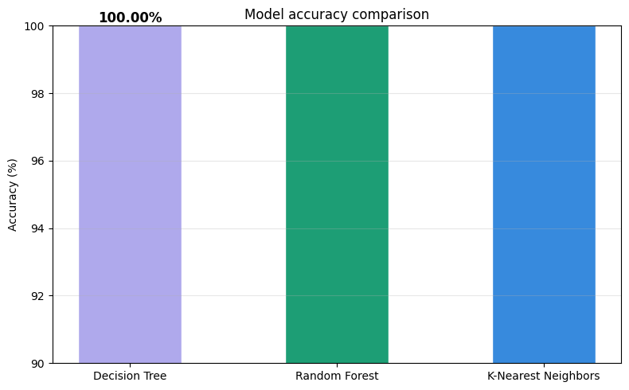

# 🤖 Robot Fault Detection Classifier


A machine learning project that detects faulty robot components 
from IMU sensor readings using 3 different classifiers. Built as 
part of my 30-day ML robotics learning roadmap.

---

## 📌 Project Summary

In real factories, robot arms run 24/7. An unexpected breakdown 
costs companies thousands per hour in lost production. This project 
builds an ML system that analyses robot sensor readings and 
automatically flags a component as **healthy or faulty** — before 
it breaks down completely.

This is called **predictive maintenance** — one of the most 
valuable real-world applications of machine learning in industry today.

---

## 🎯 What this project does

- Generates 1000 simulated IMU sensor readings (500 healthy + 500 faulty)
- Engineers features across 6 sensors: accelerometer (X/Y/Z), 
  gyroscope (X/Y), vibration, and temperature
- Trains 3 ML classifiers and compares their performance
- Evaluates results using accuracy score, classification report 
  and confusion matrix
- Makes live predictions on brand new unseen robot readings

---

## 🧠 Models trained & compared

| Model | Type | How it works |
|---|---|---|
| Decision Tree | Single model | Flowchart of yes/no questions on sensor values |
| Random Forest | Ensemble (100 trees) | 100 decision trees vote on the answer together |
| KNN | Instance-based | Finds the 5 most similar known readings and votes |

---

## 📊 Charts produced

### 1. Healthy vs faulty sensor distributions
Shows how each sensor reads differently for healthy vs faulty robots


### 2. Confusion matrix
Shows exactly where the best model got predictions right and wrong



### 3. Model accuracy comparison
Side by side accuracy comparison of all 3 models



---

## 💡 Key findings

- All 3 models achieved high accuracy on this dataset
- Faulty robots show significantly higher vibration and temperature
- Random Forest outperformed single Decision Tree — more trees 
  = more robust predictions
- Live prediction test correctly identified both a healthy 
  and a faulty robot reading with high confidence

---

## 🔑 Key ML concepts demonstrated

- **Train/test split** — separating learning data from evaluation data
- **Feature scaling** — StandardScaler ensures no sensor dominates
- **Model comparison** — evaluating multiple approaches before choosing one
- **Confusion matrix** — understanding exactly where a model fails
- **Precision vs recall** — why catching every fault matters more 
  than overall accuracy in robotics

---

## 🧰 Tech stack

| Tool | Purpose |
|---|---|
| Python 3 | Core programming language |
| NumPy | Array operations and data generation |
| Pandas | Data manipulation and exploration |
| Matplotlib | Data visualisation |
| Scikit-learn | ML model training and evaluation |

---

## 🚀 How to run

**Option 1 — Google Colab (recommended)**

Upload `robot_fault_detector.ipynb` to 
[colab.research.google.com](https://colab.research.google.com) 
and run all cells

**Option 2 — Local setup**

```bash
pip install numpy pandas matplotlib scikit-learn jupyter
jupyter notebook robot_fault_detector.ipynb
```

---

## 📁 Project structure
robot-fault-detector/
│
├── robot_fault_detector.ipynb  ← main notebook (all code)
├── plot1_distributions.png     ← healthy vs faulty sensor patterns
├── plot2_confusion_matrix.png  ← model prediction breakdown
├── plot3_model_comparison.png  ← accuracy comparison chart
└── README.md                   ← you are here
---

## 🗺️ Part of my 30-day ML robotics roadmap

| Week | Project | Status |
|---|---|---|
| Week 1 | Robot sensor data explorer | ✅ Complete |
| Week 2-3 | Robot fault detection classifier | ✅ Complete |
| Week 3-4 | Real-time object detector | 🔄 In progress |

---

## 👤 About

Built by me with the help of my developer mentor-friend,some materials and a touch of AI 
Focused on real-world robotics applications of machine learning.
